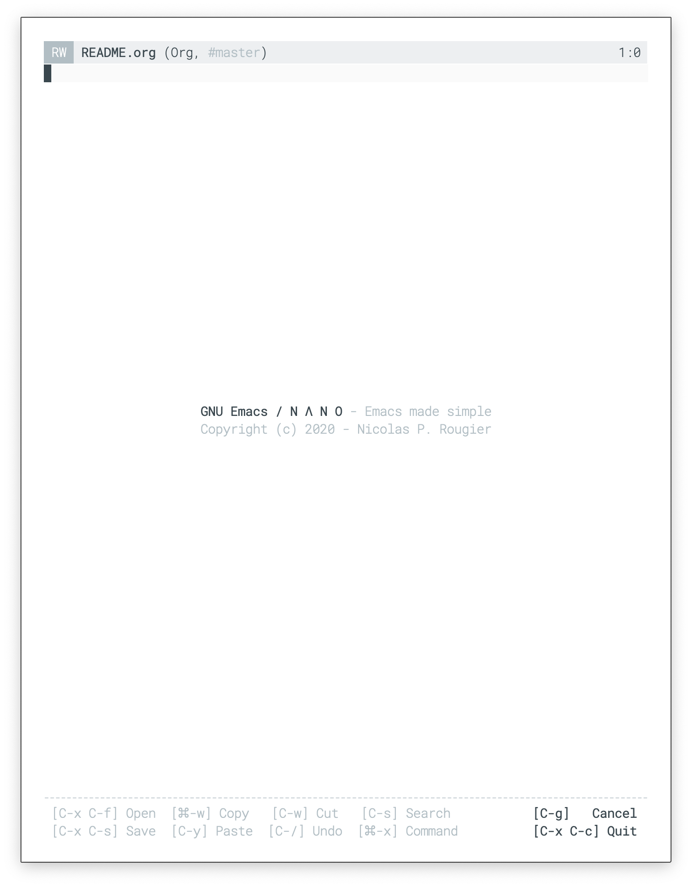
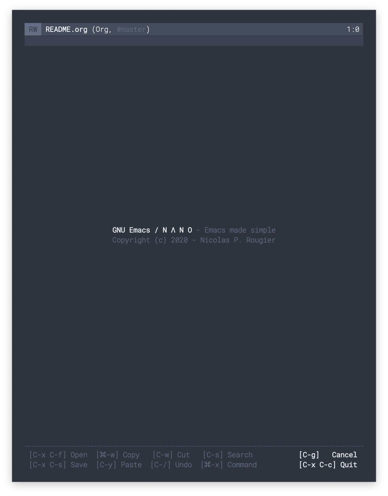
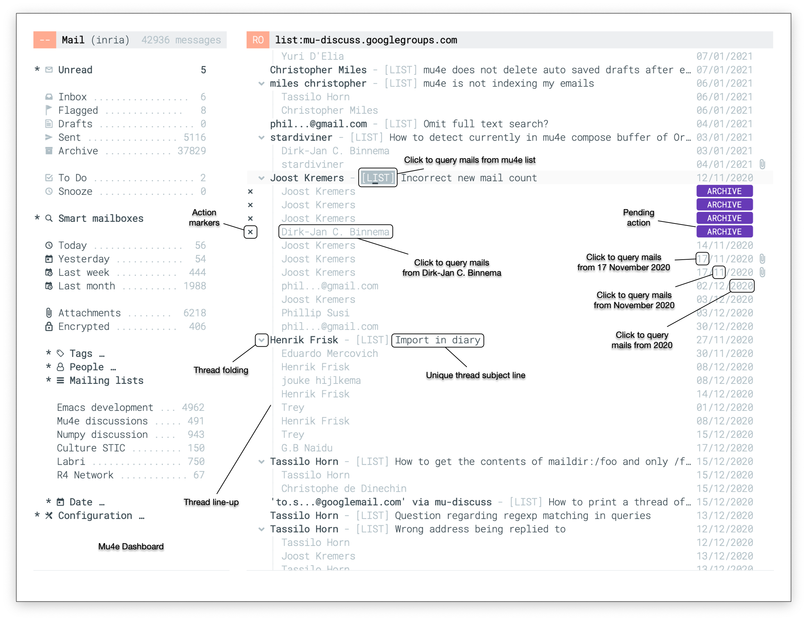
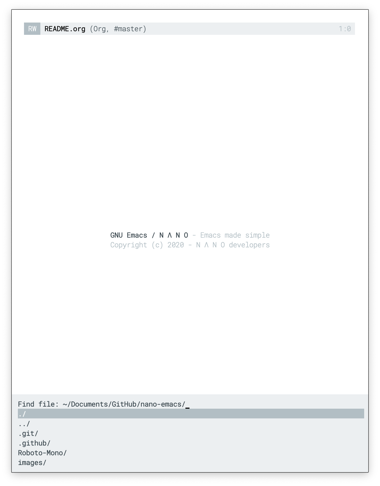
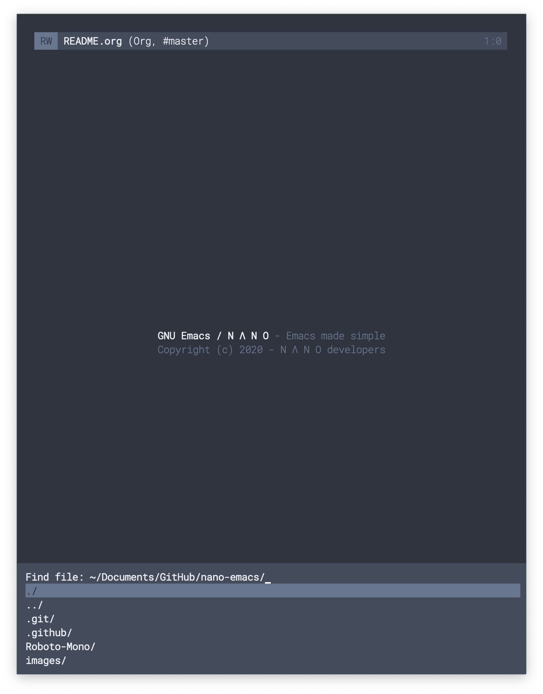
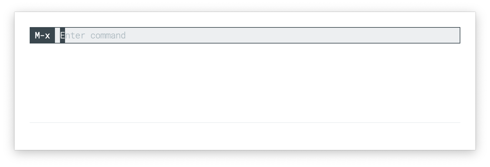
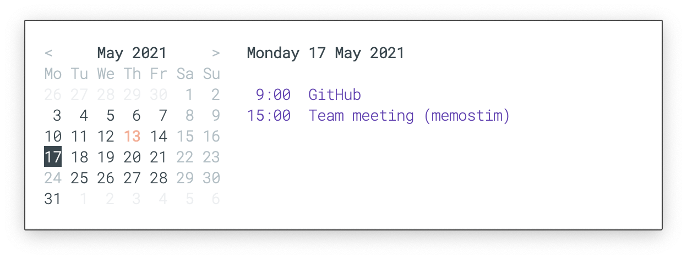

## GNU Emacs / N Λ N O

**GNU Emacs / N Λ N O** is a set of configuration files for GNU Emacs
such as to provide a nice and consistent look and feel as shown below.
It is based on design principles I described in the article "[On the
design of text Editors](https://arxiv.org/abs/2008.06030)" that is
available on arXiv. The light theme is based on [Material
colors](https://material.io/) and the dark theme is based on [Nord
colors](https://www.nordtheme.com/).

The philosophy of nano emacs is to stick as much as possible to
vanilla emacs without introducing too much dependencies (or none if
possible) and to keep it modular enough. The idea is for users to copy
the part they are interested in such as to include them in their own
configuration.

<div>


</div>

Nano Emacs is quite close to my other project [Elegant
Emacs](https://github.com/rougier/elegant-emacs) which might be
considered to be an early prototype.

### Requirements

You need a recent version of
[GNU Emacs](https://www.gnu.org/software/emacs/) and to have the
[Roboto Mono](https://fonts.google.com/specimen/Roboto+Mono) and
[Fira Code](https://fonts.google.com/specimen/Fira+Code) fonts
installed on your system. There are no other dependencies.

### Quick test

The easiest way to test nano emacs is to clone the directory on your
desktop and to type (from inside the cloned repository):

```
$ emacs -q -l nano.el
```

### Installation

If you like the result, you can either manually merge the contents of
[nano.el](nano.el) into your emacs configuration file, or install nano
through the [straight.el](https://github.com/raxod502/straight.el) package
manager.

#### Manual Installation
To merge the [nano.el](nano.el) contents with your emacs configuration,
you'll need to modify the `load-path` to include the nano emacs repository
and then call for the different modules. The only mandatory module is
`nano-faces` that defines 6 faces that are used in other modules.

#### Installation through straight.el
To install nano through [straight.el](https://github.com/raxod502/straight.el),
install straight.el, and then add the following snippet into your emacs
configuration:
``` emacs-lisp
(straight-use-package
  '(nano-emacs :type git :host github :repo "rougier/nano-emacs"))
```
from here, you may either `(require 'nano)` to pull in the default nano
configuration, or call for the different modules. The only mandatory module
is `nano-faces` that defines 6 faces that are used in other modules.

### Customization

You can customize the default font, the proportional font and the font-size.

```emacs-lisp
(setq nano-font-family-monospaced "Roboto Mono")
```

This sets the default monospaced font. Defaults to Roboto Mono. Note that if you set this to a font without proper light or bold weights you will lose many of the key design features of nano-emacs.

```emacs-lisp
(setq nano-font-family-proportional nil)
```

Set this to the name (as a string) of your favorite variable-width font to enable `variable-width-mode` and `mixed-pitch-mode`. If you have already set this somewhere else, you can use `(setq nano-font-family-proportional (face-attribute 'variable-width :family))` to use the same one.

```emacs-lisp
(setq nano-font-size 14)
```

This sets the font-size of most faces in nano-emacs.

#### Note about load-order

Because of the way nano-emacs is set up, you need to set these variables *before* you call `(nano-faces)` and `(nano-theme)`. If you change one of these variables after load/calling `(nano-faces)` and `(nano-theme)`, you will need to call them again for these changes to take effect.


### Modules

- **[nano.el](./nano.el)** (optional)

  > This module is mostly used to test nano emacs locally. Its content
    is supposed to be merged into an existing emacs configuration. See
    [Quick test](#Quick-test) section above.

#### Mandatory

* **[nano-base-colors.el](./nano-base-colors.el)**

  > This module defines the fundamental colors of nano theme.
    If your Emacs has a theme or color-scheme, make sure its loaded
    before you load nano-faces so that its colors are used by nano.

* **[nano-faces.el](./nano-faces.el)**

  > This module defines the fundamental faces of nano theme.
    If your Emacs has a theme or color-scheme, make sure its loaded
    before you load nano-faces so that its colors are used by nano.


#### Optional

- **[nano-theme-light.el](./nano-theme-light.el)** &
  **[nano-theme-dark.el](./nano-theme-dark.el)**

  > Theses modules define light and dark themes respectively by
    overriding the base colors. If your Emacs is not themed, you are
    encouraged to try one of these.

- **[nano-theme.el](./nano-theme.el)**

  > This module derives faces for several popular emacs modes from the
    nano faces. You can either use them all by calling
    `(nano-theme)`, or pick what you want by calling your selection
    of `(nano-theme--` functions.


- **[nano-help.el](./nano-help.el)**

  > This module provides a function to display a small help message in
    the echo area.

- **[nano-splash.el](./nano-splash.el)**

  > This module provides a splash screen when emacs is started.

- **[nano-modeline.el](./nano-modeline.el)**

  > This module defines a header line that is mode dependent and takes
    care of hiding the modeline when necessary.

- **[nano-layout.el](./nano-layout.el)**

  > This module defines the overall layout of an emacs frame, defining
    default font, fringes, margins, etc.

- **[nano-defaults.el](./nano-defaults.el)**

  > This modules provides a set of sane default settings for Emacs.

- **[nano-session.el](./nano-session.el)**

  > This modules configures Emacs such that a session is saved from
    one run to the other.

- **[nano-bindings.el](./nano-bindings.el)**

  > This modules provides a reduced set of keybindings for a few
    common commands.

- **[nano-counsel.el](./nano-counsel.el)**

  > This modules configures the [counsel
    package](https://elpa.gnu.org/packages/counsel.html) that needs to
    have been **installed** by user.

- **[nano-colors.el](./nano-colors.el)**

  > This module provides a collection of colors palettes
    ([open colors](https://yeun.github.io/open-color/),
     [material colors](https://material.io/),
     [nord colors](https://www.nordtheme.com/))
    with functions for easily accessing them.

#### Experimental

- **[nano-mu4e.el](./nano-mu4e.el)**

  > This package setup the look and feel of mu4e.
  
  

- **[nano-minibuffer.el](./nano-minibuffer.el)**

  > Minibuffer using [mini-frame](https://github.com/muffinmad/emacs-mini-frame)
  
  <div>
  
  
  </div>


- **[nano-command.el](./nano-command.el)**

  > This package provides an experimental command line prompt in the
  > header line. It has not history nor completion but can be used for
  > one line input such as org-capture.

  


- **[nano-agenda.el](./nano-agenda.el)**

  > An experimental interactive mini agenda that displays side by
  > side a mini calendar on the left and timestamped org entries on
  > the right.
  
  

### Related works

- [Bespoke theme](https://github.com/mclear-tools/bespoke-themes)
  Custom medium contrast light and dark themes inspired by nano emacs,
  elegant emacs, Nord and Solarized themes.
  
